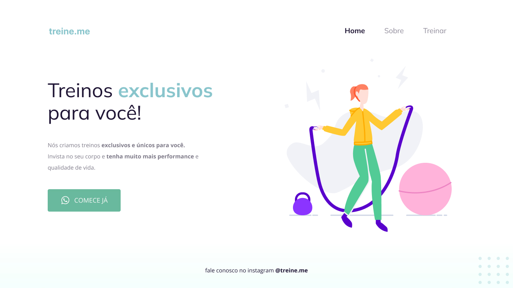
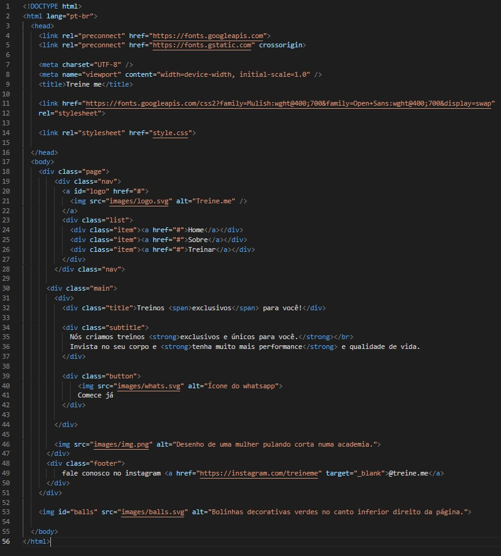

<h1 align="center">Accessibility in HTML (beginner level)</h1>

<strong>PT-BR</strong>: Acessibilidade no HTML (iniciante)

 

## 🚀 Technologies 
<strong>EN:</strong> This project was developed with the following technologies:

-----
<strong>PT-BR:</strong> Esse projeto foi desenvolvido com as seguintes tecnologias:

- HTML e CSS
- Git e Github
- Figma

 

## 📖 Project
<strong>EN:</strong> The challenge from Rocketseat's course Explorer was to fix the code of a page that, initially, had a non semantic HTML, which makes the code less accessible for screen readers and doesn't perform well in search engines, such as Google. The initial code is down below:

----
<strong>PT-BR:</strong> O desafio proposto no curso Explorer da Rocketseat é corrigir o código da página acima que, inicialmente, estava com o código HTML não semântico, o que acarreta em uma página menos acessível a leitores de tela e com performance ruim em motores de busca, como o Google. Código inicial abaixo:
 
 

- Online project: https://lidiabrentano.github.io/accessibility-in-html-01/

-----

By Lídia Brentano
